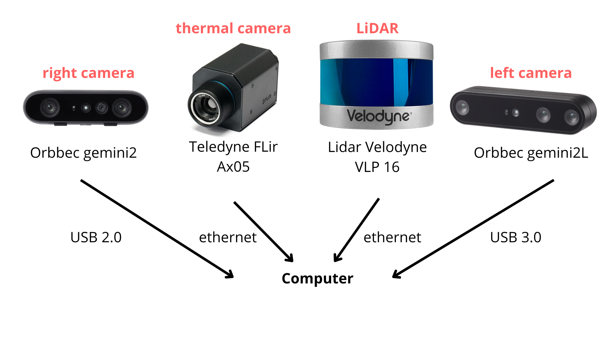

# Moonlike enviroment platform setup

This repository contains all the files, workspaces and containers to run and launch the sensor platform including the 2 Orbbec cameras: gemini2 and gemini2L, thermal camera Flir Ax5, and the Velodyne LiDAR VLP16. The project remains on two main containers, the ROS Noetic workspace and the ROS Humble workspace. Each one has a save files node that needs to be launched at the sametime to mantain synchronized data. In one hand, the ROS Noetic container administrate the RGBD cameras, the Optitrack position timestamp, the point cloud registration and the RTABMAP node as well. In the other hand, the ROS Humble container helps to run the thermal camera and the LiDAR Node. 




## Installation

1. On a Ubuntu 22 computer clone the repository in your home directory

```bash
 git clone https://github.com/ghoulishRa/Moonlike.git
```
2. Inside the directory clone this 2 repositories in order to download the ROS Humble and ROS Noetic workspaces

```bash
 cd Moonlike
 git clone https://github.com/ghoulishRa/ros2_ws.git
 git clone https://github.com/ghoulishRa/catkin_ws.git
```
3. Run the execution permission for the next files:

```bash
 chmod +x Moonlike/docker_init_ros1.sh Moonlike/docker_init_ros2.sh Moonlike/list_ob_devices.sh
 chmod +x Moonlike/rosbag/create_timestamp.sh Moonlike/rosbag/erease_files.sh 
```
The ./docker_init_ros<$VERSION$>.sh (1 or 2) starts either container once you have built them up.
The ./create_timestamp.sh helps to create the subdirectories inside the rosbag to save all the files  incase you dont have the directory created.
The ./erease_files.sh helps to erease all the files inside timestamp (use it once you have finish saving all the files in a copy directory).
    
4. Build the ROS containers using this

```bash
cd Moonlike
docker build -f Dockerfile.rosN -t ros_noetic .
docker build -f Dockerfile.rosH -t ros_humble .
```
5. Once the content is built, run the containers using the 

```bash
./docker_init_ros<$VERSION$>.sh
```
## catkin_ws commands

Run the bash file to start the ROS1 (Noetic) container

```bash
./docker_init_ros1.sh
```

### RGBD cameras (Gemini and Gemini 2L)

Change the USB port number in the multi_camera.launch file before. Check the USB connections by running this command:

```bash
./list_ob_devices.sh 
```
After checking your usb ports, change the serial number on th file

```python
<arg name="usb_port" value="4-2"/>
```
Run the multi_camera.launch and the multi_camera_tf.launch

```bash
~/catkin_ws roslaunch multi_launch multi_camera.launch
~/catkin_ws roslaunch multi_launch multi_camera_tf.launch
```

### Optitrack natnet package

Clone the Natnet repository to add the natnet ROS package at the workspace, then build the enviroment

```bash
cd Moonlike/catkin_ws/src
git clone https://github.com/L2S-lab/natnet_ros_cpp.git

cd ../../
catkin_make
```

Set an static IP address at you host machine to be on the same net as the MARS wifi network in order to receive the multibroadcast pose message.

Open a terminal and run the following command:

```bash
sudo ip addr add 192.168.137.100/24 dev wlp2s0
```
In the Optitrack computer at CBY D06 lab, select the "bee" rigid body on the Assets section, and make sure that the platform is at the origin

Run the natnet launcher

```bash
~/catkin_ws roslaunch natnet_ros_cpp natnet_ros.launch
```
### Rtabmap 

The following command helps to run the rtabmap with the gemini2 camera parameters

```bash
roslaunch rtabmap_launch rtabmap.launch \
    rgb_topic:=/camera_02/color/image_raw \
    depth_topic:=/camera_02/depth/image_raw \
    camera_info_topic:=/camera_02/color/camera_info \
    frame_id:=camera_02_link\
    subscribe_rgbd:=false\
    approx_sync:=true \
    odom_frame_id:=odom
```
Here are two videos of the sequences

<table>
  <tr>
    <td align="center">
      <a href="https://youtu.be/HjKqLHMNDjg">
        
      </a>
      <br>
      <strong>Video 1</strong>
    </td>
    <td align="center">
      <a href="https://youtu.be/B2oyJ_NOAUg">
        
      </a>
      <br>
      <strong>Video 2</strong>
    </td>
  </tr>
</table>


## ros2_ws

This container works for the LiDAR and Thermal sensors which use etehernet connection. Once you have connected the sensors go to the wifi settings section on your host machine and select both ethernet connection. In IPV4 security select "Local only" and save the changes. 

Run the container

```bash
cd Moonlike
./docker_init_ros2.sh
```

### Flir Ax5 thermal camera

In order to run the FLIR camera in the ROS2 container do the following:

```bash
~/ros2_ws cd ../..
cd opt/ros/humble/share/spinnaker_camera_driver/launch/
nano driver_node.launch.py
```
Go down the file and change the following

```python
'camera_name',
default_value=['thermal_camera']

'camera_type',
default_value='flir_ax5'

'serial',
default_value="'63201424'"
```
Save the file and exit nano. In another terminal save the changes in your container image

```bash
docker commit <docker_container_id> ros_humble
```
 Now you can launch the file 

```bash
~/ros2_ws ros2 launch spinnaker_camera_driver driver_node.launch.py 
```
### LiDAR

Run the velodyne launcher for the 16 rings LiDAR

```bash
~/ros2_ws ros2 launch velodyne velodyne-all-nodes-VLP16-launch.py 
```


